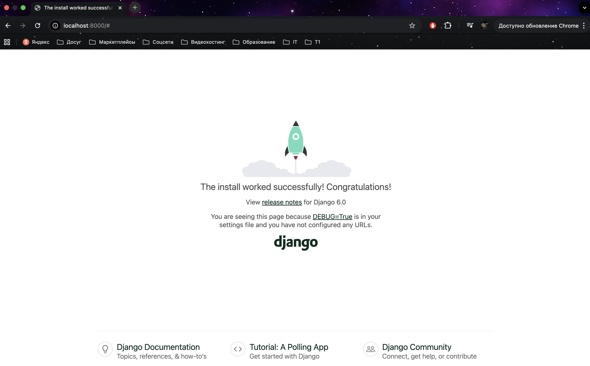
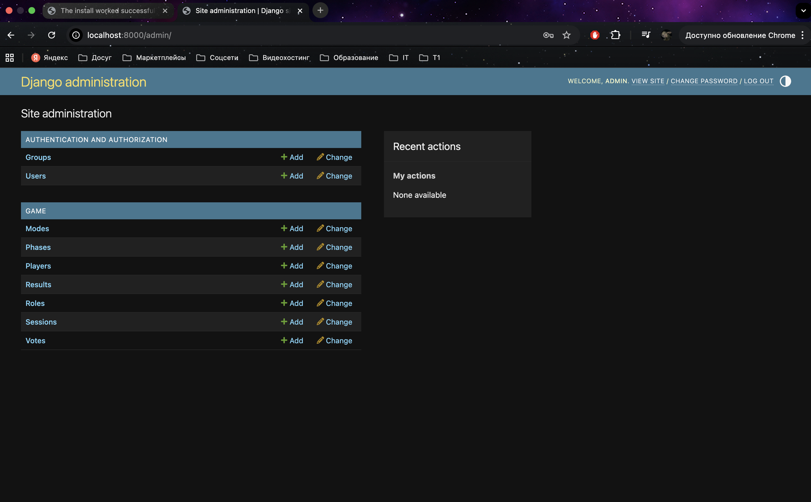

# Mafia Assistant

Веб-сервис и Telegram-бот, которые помогают ведущему управлять партией в «Мафию»: вести список игроков, роли, фазы, фиксировать результат и смотреть статистику.

> Проект разработан в рамках преддипломной практики.<br>
> Автор: Казарина Алёна Алексеевна<br>
> Начало разработки: 10.11.2025<br>
> Конец разработки: 07.12.2025<br>

## Основные возможности

- управление игровыми сессиями и режимами (классика / спортивная мафия);
- роли с описаниями и порядком хода;
- кабинет ведущего и кабинет игрока;
- Telegram-бот для управления партией.

<!-- # Mafia-assistant

Python 3.12.3

``` bash
python3 -m venv venv
source venv/bin/activate
```

``` bash
python manage.py makemigrations
python manage.py migrate
python manage.py createsuperuser
python manage.py runserver
```



>http://127.0.0.1:8000/

``` bash
python manage.py makemigrations
python manage.py migrate
python manage.py runserver
```



>http://127.0.0.1:8000/admin -->
